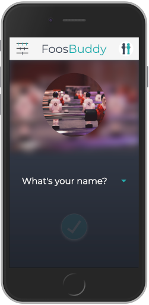

# FoosBuddy

### http://foosbuddy.herokuapp.com/

A mobile first application to find your perfect doubles partner for the next foosball tournament. Select your player profile using data that comes directly from the German Table Football Association website (https://dtfb.de/) and choose the tournament, discipline and position for which you are looking for a partner.





## Usage

Install client and server dependencies:

```
npm install
cd client
npm install
```

To start the project properly, you will need a .env file. An .env.example file is already included. The TOKEN-SECRET is needed for the user authentication and can be replaced by anything.

To start the server and client at the same time:

```
npm run dev
```
